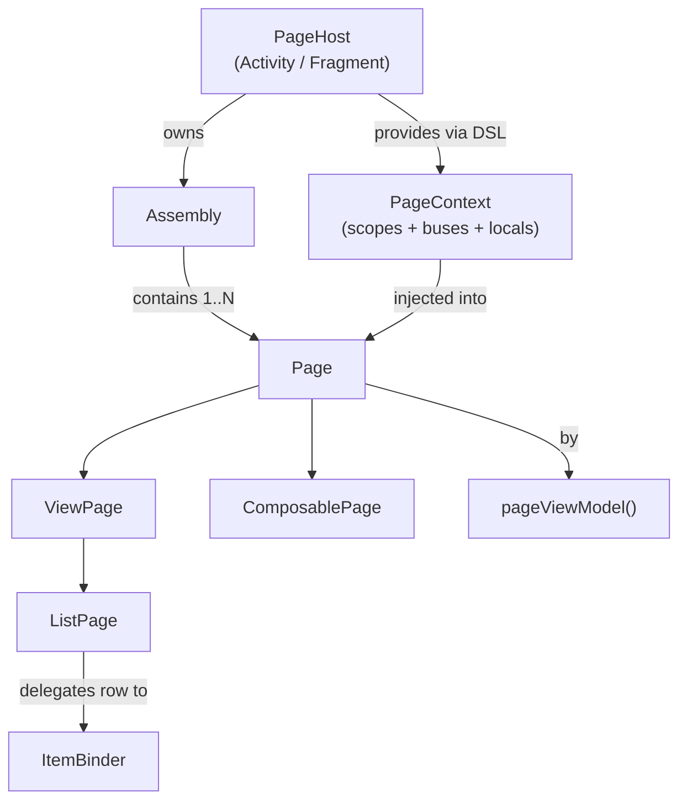

# AssembleKit

> 一个**轻量的 Page 装配框架**：用一段 Kotlin DSL 把"页面"拼出来，而不是写一堆 Fragment 或巨型 Activity。
>
> 一句话：**Activity / Fragment 只负责"是哪个屏幕"；屏幕里"长什么样、由几块组成"，交给 `assemble { … }` 描述。**

---

## 1. 这是什么 / 为什么有它

业务 Activity 几年下来通常会演化成 1500 行的"god class"：UI 拼装、ViewModel 持有、事件总线订阅、生命周期管理、A/B 实验分支……什么都在里面。
拆 Fragment 也救不了——`FragmentManager` / 回栈 / `commitNow` vs `commitAllowingStateLoss` 这套额外成本，对"一个屏幕里横向并列的几块"来说完全是过度设计。

AssembleKit 的取舍：

| 我们想要的 | 我们不想要的 |
| --- | --- |
| 每块 UI 是独立单元，可以单独移动、删除、A/B | Fragment 回栈、Transaction 时序 |
| 屏幕组装看一眼 `onCreate` 就懂 | 一个 1000 行 Activity 同时管 5 件事 |
| 单测里能 `new Page()` 直接构造 | 必须靠 Robolectric / `FragmentScenario` 才能跑 |
| 跨 Page 通信走显式 bus / Mavericks ViewModel | 兄弟 Fragment 互相 `findFragmentByTag` 拿引用 |
| 配置变更交给 [Airbnb Mavericks](https://github.com/airbnb/mavericks) | 自己拼 `onSaveInstanceState` |

设计原则（**一定要先读完再用框架，否则会写出"用了 AssembleKit 但还是 god Activity"的代码**）：

1. **Page 是 UI 切片，不是 router**。Page 不能切换 Page，重组只能由 Host 触发（[`Assembly.replace { }`](src/main/java/com/demo/foundations/assemblekit/Assembly.kt:241)）。
2. **状态走 Mavericks**，禁止裸 `StateFlow` / `LiveData` / `var field`。详见 [`docs/mvi-rules.md`](../../docs/mvi-rules.md)。
3. **每屏一个 Shell ViewModel**（[`MavericksViewModel`](https://github.com/airbnb/mavericks)），通过 [`provides(ShellKey, vm)`](src/main/java/com/demo/foundations/assemblekit/AssemblyDsl.kt:93) 共享给所有 Page。
4. **View 树读 PageContext，不要从构造函数把 ViewModel 灌进自定义 View**——这是为什么不用 Koin / Hilt 的核心原因（见 [§ 8](#8-视图树pagecontextview-tree-pagecontext)）。

---

## 2. 模块结构

```text
foundations/assemblekit/
├── build.gradle.kts                       # plugin = demo.android.foundation
└── src/main/
    ├── res/values/ids.xml                 # assemblekit_page_context_tag
    └── java/com/demo/foundations/assemblekit/
        ├── Page.kt                        # 抽象基类（生命周期/SavedState/Mavericks 桥）
        ├── ViewPage.kt                    # XML 风格 Page（默认子类型）
        ├── ComposablePage.kt              # Compose 风格 Page（stub）
        ├── Assembly.kt                    # 一组 Page 的容器，支持 replace
        ├── AssemblyDsl.kt                 # `assemble { +PageA() at R.id... }` DSL
        ├── MountSpec.kt                   # Page + 挂载容器解析
        ├── PageHost.kt                    # 宿主接口 + PageHostActivity / PageHostFragment
        ├── PageContext.kt                 # 环境对象：三层 scope / bus / locals
        ├── PageViewModel.kt               # `by pageViewModel()` 委托
        ├── ViewTreePageContext.kt         # View.findPageContext() / requirePageContext()
        ├── list/
        │   ├── ListPage.kt                # RecyclerView 列表 Page
        │   └── ItemBinder.kt              # 行渲染契约
        ├── local/
        │   └── ScopedContainer.kt         # provides/consume 容器 + PageContextKey<T>
        └── bus/
            ├── ScopedEventBus.kt          # 单向广播
            └── ScopedCommandBus.kt        # 请求-响应
```

**类层次一图（Mermaid）：**



---

## 3. 快速上手（60 秒版）

最小可运行例子：一个登录页，由 Header / Body / Bottom 三块组成。

### 3.1 写 Host

```kotlin
class LoginActivity : PageHostActivity() {           // 1. 继承 PageHostActivity
    override fun onCreate(s: Bundle?) {
        super.onCreate(s)
        setContentView(R.layout.activity_login)      // 普通 setContentView，没特殊要求

        val root = findViewById<FrameLayout>(R.id.login_root)
        assemble(container = root) {                 // 2. 调用 assemble { }
            +LoginHeaderPage()
            +LoginBodyPage()
            +LoginBottomPage()
        }
    }
}
```

### 3.2 写 Page

```kotlin
class LoginBodyPage : ViewPage() {                   // 3. 继承 ViewPage
    private val viewModel: LoginBodyViewModel by pageViewModel()

    override fun onCreateView(inflater: LayoutInflater, parent: ViewGroup): View =
        LoginPageBodyBinding.inflate(inflater, parent, false).root

    override fun onViewCreated(view: View) {
        // 4. 渲染只走 onEach / onAsync，禁止裸 collect / withState
        viewModel.onEach(LoginBodyState::canSubmit) { canSubmit ->
            view.findViewById<Button>(R.id.submit).isEnabled = canSubmit
        }
    }
}
```

### 3.3 写 ViewModel（Mavericks）

```kotlin
data class LoginBodyState(
    val phone: String = "",
    val code: String = "",
) : MavericksState {
    val canSubmit: Boolean get() = phone.length == 11 && code.length == 4
}

class LoginBodyViewModel(state: LoginBodyState) : MavericksViewModel<LoginBodyState>(state) {
    fun onPhoneChanged(p: String) = setState { copy(phone = p) }
    fun onCodeChanged(c: String)  = setState { copy(code = c) }
}
```

完整可运行版本看 [`features/login`](../../features/login)。

---

## 4. DSL 速查

`assemble {}` 是入口（[`PageHost.assemble`](src/main/java/com/demo/foundations/assemblekit/AssemblyDsl.kt:132)）。**仅 Host 可调用，Page 不能调用。**

| 写法 | 含义 |
| --- | --- |
| `+MyPage()` | 把 Page 加入 Assembly，挂到默认容器 |
| `+MyPage() at R.id.slot_top` | 把 Page 钉到指定 `ViewGroup` slot |
| `page(factory.create())` | 工厂场景下 `unaryPlus` 不顺手时的替代 |
| `whenever(flag) { +PromoPage() }` | A/B / RemoteConfig 条件包含 |
| `provides(MyKey, value)` | 在 **Assembly 作用域**注册 local，子 Page 可 `consume` |

两种常用排版模式：

```kotlin
// 模式 A：单容器堆叠（最常见）
assemble(container = root) {
    +HeaderPage()
    +BodyPage()
    +BottomPage()
}

// 模式 B：多 slot 钉位（屏幕有固定槽位时）
assemble {
    +HeaderPage()  at R.id.slot_top
    +ListPage()    at R.id.slot_middle
    +BottomPage()  at R.id.slot_bottom
}
```

两者可混用：默认容器 + 部分 Page 用 `at(...)` 钉到具体 slot 即可。

---

## 5. Page 生命周期

Page 的生命周期是宿主生命周期的**镜像**（不是子集，也不是平行）：

```text
attach(ctx)        → CREATED          // performAttach: 注入 PageContext + 恢复 SavedState
materialize        → ...              // ViewPage.onCreateView / ComposablePage.Content
host ON_START      → STARTED
host ON_RESUME     → RESUMED
host ON_PAUSE      → STARTED
host ON_STOP       → CREATED
detach             → DESTROYED        // pageScope 取消，bus / VM 订阅自动断开
```

子类只需要关心三个钩子（在 `ViewPage` 上）：

| 钩子 | 干什么 | 不要在这里干什么 |
| --- | --- | --- |
| `onCreateView(inflater, parent)` | inflate / 构建根 View | **不要**自己把 View 加进 parent，框架会加 |
| `onViewCreated(view)` | 绑定 `viewModel.onEach`、设监听器、订 bus | 不要在这里启动只在 STARTED/RESUMED 才该跑的工作——用 `lifecycle.repeatOnLifecycle` |
| `onDestroyView()` | 释放视图相关资源（cursor、Bitmap 等） | 协程 / bus 订阅由 `pageScope` 自动取消，不用手动 cancel |

**重要**：[`Page.invalidate()`](src/main/java/com/demo/foundations/assemblekit/Page.kt:107) 被框架置空。Mavericks 默认的"整页 invalidate"不准用——所有 UI 订阅一律走 `onEach(prop)` / `onAsync(prop)`，强制按需重渲，效率和精度都更好。

---

## 6. PageContext：三层 scope / bus / locals

[`PageContext`](src/main/java/com/demo/foundations/assemblekit/PageContext.kt) 是框架注入到每个 Page 的"环境对象"。
它把宿主、协程、bus、locals **按三层 scope** 暴露出来：

| 层级 | scope | bus | 取消时机 |
| --- | --- | --- | --- |
| **page**     | `pageScope`     | `pageBus`     | Page detach |
| **assembly** | `assemblyScope` | `assemblyBus` | Assembly 销毁 |
| **host**     | `hostScope`     | `hostBus`     | Activity / Fragment 销毁 |

挑选原则：**用能满足需求的最小 scope**。
比如行内按钮的点击日志 → `pageScope`；同屏 Page 之间通信 → `assemblyBus`；跨屏全局事件 → `hostBus`。

### 6.1 `provides` / `consume`（scoped locals）

scoped locals 是 React Context / Compose CompositionLocal 的对应物。**用它而不是构造函数注入**，让横向依赖在"屏幕内可见、屏幕外不可见"。

```kotlin
// 1. 定义 key（必须放在 top-level val 上，身份按实例而非按名字）
val FeedRepositoryKey = pageContextKey<FeedRepository>("feed.repository")

// 2. 在 assemble 里 provide
assemble {
    provides(FeedRepositoryKey, FeedRepository.real())
    +FeedHeaderPage()
    +FeedListPage()
}

// 3. 在 Page 里 consume
class FeedHeaderPage : ViewPage() {
    override fun onViewCreated(view: View) {
        val repo = requireConsume(FeedRepositoryKey)
        // …
    }
}
```

查找顺序：`pageLocal → assemblyLocal → hostLocal`，第一个命中的返回。
也就是说：

- 全局 / 跨屏依赖 → 在 Host 的 `hostLocal[key] = value` 里放（推荐放在 `onCreate` super 之后、`assemble` 之前）。
- 一屏内共享 → `provides(key, value)` 在 `assemble {}` 块里。
- 单个 Page 想 shadow 父层值（如预览模式用 fake repo）→ Page 里 `providesPage(key, fake)`。

> **何时该 provide 一个 ViewModel？** 仅当它是**屏幕级 Shell VM**。普通的 per-Page VM 直接 `by pageViewModel()` 即可。

### 6.2 事件 / 命令 bus

```kotlin
// 发：
emitToAssembly(MyEvent.ItemLiked(id))         // 给同屏兄弟 Page
emitToHost(MyEvent.LoggedIn)                  // 给 Activity / 整个 Host

// 收（在 Page 子类里）：
onAssemblyEvent<MyEvent.ItemLiked> { e -> /* … */ }
onHostEvent<MyEvent.LoggedIn>      { /* … */ }
```

`ScopedCommandBus` 走请求-响应；语义看 [`bus/ScopedCommandBus.kt`](src/main/java/com/demo/foundations/assemblekit/bus/ScopedCommandBus.kt)。

> **重要**：bus 只用于**真正瞬时的 fire-and-forget**信号（toast、导航请求）。
> 凡是"应当出现在 UI 状态里"的东西，必须走 Mavericks state，不要走 bus。详见 [`docs/mvi-rules.md`](../../docs/mvi-rules.md) M4。

---

## 7. ListPage + ItemBinder

要展示一个长列表？**不要**自己塞 RecyclerView 进某个 Page——用 [`ListPage<T>`](src/main/java/com/demo/foundations/assemblekit/list/ListPage.kt) + [`ItemBinder<T>`](src/main/java/com/demo/foundations/assemblekit/list/ItemBinder.kt)。

```kotlin
// 1. Binder：无状态，单实例复用
class NoteItemBinder : ItemBinder<Note> {
    override fun createView(parent: ViewGroup, ctx: PageContext): View =
        FeedItemNoteBinding.inflate(LayoutInflater.from(parent.context), parent, false).root

    override fun bind(view: View, item: Note, position: Int, ctx: PageContext) {
        val vm = ctx.requireConsume(FeedShellViewModelKey)
        view.findViewById<TextView>(R.id.title).text = item.title
        view.setOnClickListener { vm.likeOne(item.id) }
    }

    override fun areItemsTheSame(old: Note, new: Note) = old.id == new.id
}

// 2. ListPage：本质就是 ViewPage，托管 RecyclerView
class NotesListPage(itemsFlow: Flow<List<Note>>)
    : ListPage<Note>(itemsFlow = itemsFlow, itemBinder = NoteItemBinder())

// 3. 在 assemble 里
assemble {
    provides(FeedShellViewModelKey, shellVm)
    +NotesListPage(shellVm.stateFlow.map { it.notes })
}
```

**关键设计**：每行 `itemView` 会被框架自动盖上**父 Page 的 PageContext**（[`ListPage.kt:128`](src/main/java/com/demo/foundations/assemblekit/list/ListPage.kt:128)），所以行内自定义 View / 嵌套 RecyclerView 的 ViewHolder 都能用 `view.requirePageContext()` 直接拿到同一个 Shell VM——见下一节。

**为什么行不是 Page？** 一千行的 feed 不应该分配一千个 LifecycleOwner / Mavericks VM / 事件 bus。Binder 是无状态渲染契约；状态在 `T` 自己或者 Shell VM 里。

---

## 8. 视图树 PageContext（View-tree PageContext）

> 这是 AssembleKit 用来**取代 Koin / Hilt 在 View 层的注入**的机制。

场景：你写了个深度复用的 widget `NoteActionBar`，它在屏幕里嵌在 list 行的某个 ViewGroup 里（深度 3-5 层），它需要在用户点赞时调用 `FeedShellViewModel.likeOne(noteId)`。

**反例**（千万别这么写）：

```kotlin
// 反例 1：构造函数灌 VM —— widget 跟某个 feature 绑死了
class NoteActionBar(ctx: Context, val vm: FeedShellViewModel) : LinearLayout(ctx)

// 反例 2：从 DI 容器 service-locate VM —— 拿到的不一定是 *this 屏* 的 VM
class NoteActionBar(ctx: Context) : LinearLayout(ctx) {
    private val vm = KoinJavaComponent.get<FeedShellViewModel>()
    //                                 ↑ 多 host 场景这是错的 VM
}
```

**正解**：

```kotlin
class NoteActionBar(ctx: Context, attrs: AttributeSet?) : LinearLayout(ctx, attrs) {
    private var noteId: String? = null
    fun bind(noteId: String) { this.noteId = noteId }

    init {
        likeButton.setOnClickListener {
            val id = noteId ?: return@setOnClickListener
            requirePageContext()                                  // 沿 parent 链找最近的 PageContext
                .requireConsume(FeedShellViewModelKey)            // 拿到 *本屏* 的 Shell VM
                .likeOne(id)
        }
    }
}
```

API：

| 函数 | 行为 |
| --- | --- |
| [`View.findPageContext()`](src/main/java/com/demo/foundations/assemblekit/ViewTreePageContext.kt:71) | 沿 `view.parent` 找最近 PageContext，找不到返回 `null` |
| [`View.requirePageContext()`](src/main/java/com/demo/foundations/assemblekit/ViewTreePageContext.kt:89) | 同上，找不到抛错（错误消息会指出在哪一类 View 出问题） |
| [`View.setPageContext(ctx)`](src/main/java/com/demo/foundations/assemblekit/ViewTreePageContext.kt:60) | **你几乎永远不需要调用它**——框架在 Page 根 / ListPage 每行自动盖戳 |

#### 自动盖戳的两个点

- [`Page.performAttach`](src/main/java/com/demo/foundations/assemblekit/Page.kt:212) → 给 `materialize` 返回的根 View 盖戳。
- [`ListPage.BinderAdapter.onCreateViewHolder`](src/main/java/com/demo/foundations/assemblekit/list/ListPage.kt:121) → 给每行 `itemView` 盖戳。

#### 生命周期安全

戳是 `View.setTag(...)`，**强引用** PageContext，而 PageContext 持有宿主。所以框架在 [`Page.performDetach`](src/main/java/com/demo/foundations/assemblekit/Page.kt:249) 和 [`ListPage.onDestroyView`](src/main/java/com/demo/foundations/assemblekit/list/ListPage.kt:107) 里**主动清掉戳**——视图就算被外部缓存（截图工具、Pool）也不会拖住宿主活着。

#### 不用 Koin / Hilt 的真实原因

完整论述见 [`docs/mvi-rules.md` § Why not Koin/Hilt/Dagger](../../docs/mvi-rules.md#why-not-koin)。核心三条：

1. **作用域错配**：DI 容器是全局的；PageContext 是页面作用域的。多 host 共存时 DI 拿到的是"任意一个活实例"，未必是 _本屏_ 的那个。
2. **它会开 MVI 后门**：一旦 View 能直接 `get<FeedShellViewModel>()`，"VM 是状态唯一来源"这条规则就形同虚设——任何人都能从 View 旁路掉 state，回到 raw mutation 老路上去。
3. **生命周期不齐**：Koin scope 跟 Android lifecycle 是手动绑的；View-tree 走的是 AndroidX 标准模式，detach 自动断引用。

---

## 9. Assembly.replace { … }：宿主驱动的结构重组

业务里经常需要"登录成功后把整个屏幕换成另一组 Page"。**不要**用 visibility 切，也**不要**让 Page 自己改结构。
用 [`Assembly.replace { }`](src/main/java/com/demo/foundations/assemblekit/Assembly.kt:241)：

```kotlin
class LoginActivity : PageHostActivity() {
    private lateinit var loginAssembly: Assembly

    override fun onCreate(s: Bundle?) {
        super.onCreate(s)
        loginAssembly = assemble(container = root) {
            +LoginHeaderPage()
            +LoginBodyPage()
        }

        hostBus.on<LoginEvent.Succeeded>(lifecycleScope) {
            loginAssembly.replace {                          // 只有 Host 能调
                +WelcomeHeaderPage()
                +ContinuePage()
            }
        }
    }
}
```

行为：

- 旧 Page 按逆序 `performDetach`（取消协程、清 View-tree 戳、移除 host observer）。
- `assemblyLocal` 被清掉（host 的 `hostLocal` 不动）。
- 新 builder 跑一遍，按声明顺序 attach。

#### Page 是看不到 Assembly 的（设计约束）

Page 没有任何 API 能拿到自己所在的 `Assembly`——这是有意为之。
Page 能改结构 = Page 成了 router，于是 Page 又开始相互调用，AssembleKit 就退化成 Fragment 了。重组是 **Host 的职责**。

#### `replace` 必须由 state 驱动

在 host 里写 `viewModel.onEach(State::structuralFlag) { flag -> assembly.replace { ... } }`，**不要**写在点击监听里。详见 [`docs/mvi-rules.md`](../../docs/mvi-rules.md) M5。

---

## 10. ViewModel：`by pageViewModel()` 与 Shell VM 模式

### 10.1 per-Page VM（一块 UI 自己的局部状态）

```kotlin
class LoginBodyPage : ViewPage() {
    private val viewModel: LoginBodyViewModel by pageViewModel()
}
```

[`pageViewModel<VM, S>()`](src/main/java/com/demo/foundations/assemblekit/PageViewModel.kt:39) 的核心选择：

- VM 实例**存在 host Activity 的 `ViewModelStore`**——这样配置变更后会自动恢复。
- key 用 `{pageId}::{VMClass}`——每个 Page 拿自己那一份，不会串。
- `Assembly.replace` 之后旧 Page 的 VM 会留在 host store 直到 host 销毁；常见 Activity-级别 assembly 这是 OK 的，bottom-sheet 等短生命场景未来会加 `Assembly.dispose()`。

### 10.2 Shell VM 模式（一屏唯一）

每个**业务屏幕**只有一个 Shell VM，由 host 创建，通过 `provides(ShellKey, vm)` 共享给所有 Page。
完整范例：[`features/feed/.../FeedActivity.kt`](../../features/feed/src/main/java/com/demo/features/feed/FeedActivity.kt) +
[`FeedShellState.kt`](../../features/feed/src/main/java/com/demo/features/feed/FeedShellState.kt) +
[`FeedShellViewModel.kt`](../../features/feed/src/main/java/com/demo/features/feed/FeedShellViewModel.kt)。

```kotlin
class FeedActivity : PageHostActivity() {
    private val shellVm: FeedShellViewModel by viewModel()   // Activity-scoped

    override fun onCreate(s: Bundle?) {
        super.onCreate(s)
        feedAssembly = assemble(container = root) {
            provides(FeedShellViewModelKey, shellVm)         // 所有 Page / Binder / 深层 widget 都能 consume
            +FeedHeaderPage()
            +FeedListPage(shellVm.stateFlow.map { it.notes })
            +FeedFooterPage()
        }

        // 结构重组也由 state 驱动：
        shellVm.onEach(FeedShellState::showBanner) { show ->
            if (matchesBannerState(show)) return@onEach
            feedAssembly.replace {
                provides(FeedShellViewModelKey, shellVm)
                if (show) +FeedBannerPage()
                +FeedHeaderPage(); +FeedListPage(...); +FeedFooterPage()
            }
        }
    }
}
```

---

## 11. PR Checklist（提交前对一下）

- [ ] Host 继承 `PageHostActivity` 或 `PageHostFragment`（或实现 `PageHost`）。
- [ ] 每屏 1 个 Shell VM；per-Page 局部状态用 `by pageViewModel()`，**没有**裸 `StateFlow` / `LiveData` / `var`。
- [ ] UI 订阅只用 `vm.onEach(prop)` / `onAsync(prop)`，**没有** `viewModelScope.launch { state.collect { ... } }`，**没有** `withState { ... }` 驱动 UI。
- [ ] 副作用是 `vm.someAction()` 方法调用，**不**是 bus 事件（除非真的是 toast / 导航这种瞬时信号）。
- [ ] 结构重组由 `viewModel.onEach(State::flag)` 触发 `assembly.replace { }`，**不**在点击监听里调 `replace`。
- [ ] 深层自定义 View 通过 `view.requirePageContext().requireConsume(...)` 拿 Shell VM，**没有**把 VM 塞进构造函数 / `setVm()` / `KoinJavaComponent.get<>()`。
- [ ] List 行用 `ItemBinder`，**不是**再嵌一个 Page。
- [ ] 跨 module 的常量 / 依赖 key：放在 feature 模块的 `XxxKeys.kt` 里，类型为 `PageContextKey<T>`。

---

## 12. 参考实现 & 延伸阅读

| 想看 | 看这里 |
| --- | --- |
| 最小 AssembleKit 例子（单 host + 几个 Page + per-Page VM） | [`features/login`](../../features/login) |
| 完整 Mavericks + Shell VM + ListPage + 深层 widget 取 VM + `replace` | [`features/feed`](../../features/feed) |
| MVI 6 条不可商量规则 (M1-M6) 与 12 条反模式 (A1-A12) | [`docs/mvi-rules.md`](../../docs/mvi-rules.md) |
| 框架在整体架构里的位置 / AssembleKit v2 设计文档 | [`docs/architecture.md`](../../docs/architecture.md) |
| 模块依赖分层规则 | [`docs/module-rules.md`](../../docs/module-rules.md) |
| 项目层面的工程规范 | [`AGENTS.md`](../../AGENTS.md) |

---

## 13. FAQ

**Q：能用 Fragment 装一组 Page 吗？**
A：可以。`PageHostFragment` 是为这个准备的。常见用例是 `ViewPager2` 每个 tab 里跑一个 Assembly。

**Q：Page 想监听 Activity 的 `onBackPressed`？**
A：Activity 拦截后通过 `hostBus.emit(...)` 通知；Page 用 `onHostEvent<...>` 订。Page 不应直接持有 Activity 引用。

**Q：可以在 Page 里 `startActivity` / 跳转吗？**
A：可以，但推荐走 [`:foundations:router`](../router)，让跨 feature 跳转保持唯一入口。

**Q：Compose 怎么用？**
A：目前 [`ComposablePage`](src/main/java/com/demo/foundations/assemblekit/ComposablePage.kt) 是 stub。等 `:foundations:assemblekit-compose` 子模块到位后，会提供 `Content()` 风格的 Page 子类型；上面所有 PageContext / Shell VM / 结构重组的规则保持不变。

**Q：Mavericks 学习曲线？**
A：90% 场景只需要四个 API：`MavericksState`、`MavericksViewModel.setState { copy(...) }`、`vm.onEach(State::prop) { ... }`、`vm.onAsync(State::asyncProp, ...)`。其它（`withState`、`@PersistState`、`MvRxStateStore`）等需要再查。

**Q：性能担忧？**
A：实测 5-10 个 Page 的屏幕，attach 总耗时和单 Activity 没有可观察差异；Page 是普通 Kotlin 对象，没有 Fragment 那种 Transaction / Manager 开销；列表用 `ListPage` 走 RecyclerView + DiffUtil，跟原生用法一致。

---

如果你读到这儿还有疑问，或者发现了文档跟代码对不上，**请直接改这个 README**——
本仓库的 [`AGENTS.md` Rule 0](../../AGENTS.md) 要求设计文档跟代码同步演进。
